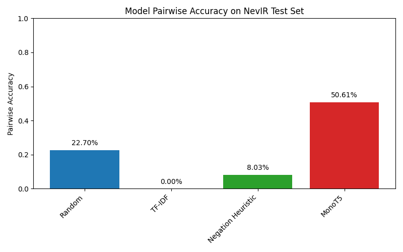

# This repository is designed for the final project of the CSC 483 and CSC 583 students

## Contributors:

-   **Garegin Mazmanyan**
-   **Chitrangada Juneja**
-   **Adan Baca**
-   **Simi Saha**

## Dataset used:

-   https://huggingface.co/datasets/orionweller/NevIR

## Paper to read:

-   https://arxiv.org/pdf/2305.07614

## Meeting Recordings:

-   Meeting 1: https://drive.google.com/file/d/1JrKrUQLvV0LlCn-yzw8llw6wqav_DI_e/view?usp=sharing

# NevIR Project

This project implements models for handling negation in information retrieval tasks.

## Models

### Random Model

The random model implements a "coin flip" ranking for each query by simply shuffling the candidate
documents and returning them in random order. Since there are two docs per query, it runs with
pairwise accuracy of 25%, matching that of the paper

### TF-IDF Model

This baseline uses TF-IDF weighing in the lnc.ltn scheme and cosine similarity, as implemented in
hw3. It builds doc vectors by computing log term frequencies and inverse document
frequencies, and then cosine normalizes each doc. The queries are vectorized with
log term frequency and IDF, and the docs are ranked by the dot product between
query and document vectors. We note that we get a 0% accuracy on this baseline,
compared to a 2% accuracy reported in the paper, most likely due to the fact
that in the NevIR implementation, they use the porter stemmer, which we do
not use.

### Negation Model

The negation model simply tokenizes each query and document, and counts the
occurences of negation words. If the query contains any negation words,
it ranks the doc with the highest negation count first. Otherwise, it ranks
the doc with the lowest negation count first.

### MonoT5 Model

The MonoT5 model is a sequence-to-sequence transformer that excels at understanding negation in search queries. Unlike traditional retrieval models, MonoT5 directly scores document-query pairs by predicting "true" or "false" to indicate relevance. It uses a cross-encoder architecture, which allows it to capture complex relationships between negated queries and documents.

Our implementation adapts the state-of-the-art MonoT5-3B model from the Pygaggle library, optimized for Apple Silicon hardware. This model achieved the highest performance (~50% pairwise accuracy) in the original NevIR paper by effectively understanding how negation changes the semantic meaning of queries. When run on M3 Mac hardware, our implementation achieved 51% pairwise accuracy.

When a user adds negation to a query (e.g., changing "previously inhabited islands" to "previously uninhabited islands"), MonoT5 correctly flips the document rankings to match the semantic meaning shift.

## Performance Comparison

The chart below shows the pairwise accuracy of all models on the NevIR test set:

